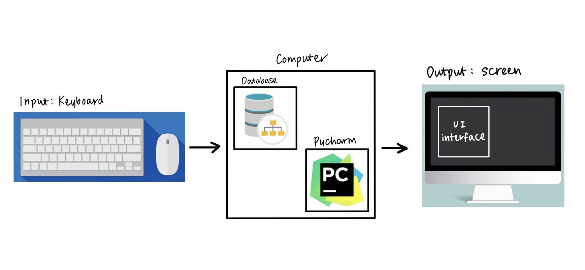

# Unit 3: Ski documentation application

# Criteria A: Planning

## Problem definition
My client for this project is my classmate, Elia Kobayashi, and he is a skier. During the winter, he is extremely active in skiing and he skiis very frequently. 
He aims to improve his skills and performance, however, it is difficult to determine improvements and practice times due to the lack of resources for his documentation of practices. From this inconvenience raised, my client would like an organised platform where his ski session details could be recorded and viewd easily. 

## Proposed Solution
### Design statement
To address the issue above, I would like to create an app that documents his ski progression and records. This app will be created using Python 3.0 and Kivy Library in corporation with GUI. The program will be coded on PyCharm. The app consists of a secure login and sign up system, where users could document nessasary information for documentation. This project will take 4 weeks and will be evaluated according to the criterias.  ** More details under 'Details' below. **

### Justification 
This game is created using python because it is the only language I am familiar with, and it is one of the most commonly used programming languages in the world. The game will be based on Mac OS, with an application called Pycharm. Pycharm was chosen to be used for this project because I am familiar with the application, and is one of the most used coding applications in the world. Pycharm is beginner-friendly in which the errors are clearly identified and highlighted. In addition, Pycharm processes are quick and efficient and therefore increases productivity and speed of my work. 

GUI is ulitilized for this project as I would like to make the app easy for the users to identify and use, thus making it more visual and useful for the users. Kivy Library will be utilized for the reason that is links with Python, and it could be presented in an organized manner, which will be extremely useful when we program detailed and long codes like in this project. The classes and inheritances can be easily displayed, and it also provides detailed customozation, making the final product personal and adjustabe for the user purpose. 

### Details
 The app will have a secure login system, where the user will first need to create an account. Their personal information; email, username, phonenumber, password and age. Once user infromation is created and stored, the user can then sign into the app using their username and password that they have set. In this app the user can input new/additional records, and view previous records as lists. The inputs that the user is able to put in are; training duration, date, max speed, location, total distance, and weather. There are separte screens for each operation, so the users are able to transfer into different screens accordingly. 
 
## Success Criteria
1. Include calendar for chosing date
2. Functioning sign up/sign in system with secure password storage (encrypted)
3. Ability for the user to input information for documentation of ski practice
4. Ability for the user to be able to view all the saved records on a screen
5. ski/winter themed login page
6. Ability to edit inputted data

# Criteria B: Design

## Sketch of app
 
Figure 1: Sketch of the relationship between the screens and their functions

## System Diagram
 
Figure 2: System diagram with input, process, and output

 
Figure 3: ER diagram of user and ski athlete

 
Figure 4: UML diagram: this shows that there will be two datatables; user and athlete. 
For one user, there could be n number of athlete information inputs.

 
Figure x: sample table for both 'athlete' and 'athlete'

The system will be based on Mac OS 10.15.6 with Dual-Core Intel Core i3. This game will be created on python 3.9, where input will be from keyboard and output generated as text and visuals on screen monitor. 

## Flow Diagrams

## Test plan

## Record of Tasks
| Task number | Planned action                                        | Planned outcome                                                         | Time estimate | Target completion date | Criteria |
|-------------|-------------------------------------------------------|-------------------------------------------------------------------------|---------------|------------------------|----------|
| 1           | Inquire the clients needs                             | rough plan of what the app would be                                     | 20            | March 2                | A        |
| 2           | Confirm proposed solution                             | there is a solid proposed solution for further process                  | 20            |                        | A        |
| 3           | Document; design statement, justification, details    | have all the three sections on github                                   | 30            |                        | A        |
| 4           | List and create success criteria, confirm with client | have confirmed criteria listed on github, after being checked by client | 20            |                        | A        |
| 5           | sketch the design solution                            | upload sketch of the application                                        | 20            |                        | B        |
| 6           | create system diagram                                 | create and upload the system diagram                                    | 20            |                        | B        |
| 7           | create ER diagram                                     | create and upload the ER diagram                                        | 20            |                        | B        |
| 8           | create UML diagram                                    | create and upload the UML diagram                                       | 20            |                        | B        |
| 9           | create sample table                                   | create and upload the sample tables                                     | 15            |                        | B        |
| 10          | create the kivy file with screens and details         | create the kivy file and screens within                                 | 60            |                        | C        |
| 11          | prepare base of app                                   | create screen manager, basic settings of the app                        | 30            |                        | C        |
| 12          | code login screen                                     | lode the login screen and all the functions inside                      | 40            |                        | C        |
| 13          | code welcome screen                                   | lode the login screen and all the functions inside                      |               |                        | C        |
| 14          | code register screen                                  | lode the register screen and all the functions inside                   |               |                        | C        |
| 15          | code data input screen                                | lode the input screen and all the functions inside                      |               |                        | C        |
| 16          | code data viewing screen                              | lode the viewing screen and all the functions inside                    |               |                        | C        |
| 17          | code edit data screen                                 | lode the editing screen and all the functions inside                    |               |                        | C        |
| 18          | check the program                                     |                                                                         |               |                        | C        |
| 19          | create flow diagrams                                  |                                                                         |               |                        | B        |
| 20          | testing                                               |                                                                         |               |                        | D        |
| 21          | video demonstration                                   |                                                                         |               |                        | D        |
| 22          | upload all neccessary information on github           |                                                                         |               |                        | -        |                               

### MVP code

### Citations
SQL create table and insert data - youtube. (n.d.). Retrieved April 19, 2022, from https://www.youtube.com/watch?v=LAP9-vu-KgU 

Theming. Theming - KivyMD 1.0.0.dev0 documentation. (n.d.). Retrieved April 20, 2022, from https://kivymd.readthedocs.io/en/latest/themes/theming/index.html 

SQLALCHEMY 1.1 documentation. Engine Configuration - SQLAlchemy 1.1 Documentation. (n.d.). Retrieved April 20, 2022, from https://docs-sqlalchemy.readthedocs.io/ko/latest/core/engines.html 

SQLAlchemy 1.3 documentation. Basic Use - SQLAlchemy 1.3 Documentation. (n.d.). Retrieved April 20, 2022, from https://docs.sqlalchemy.org/en/13/orm/extensions/declarative/basic_use.html 

