# Unit 3: Ski documentation application


# Criteria A: Planning

## Problem definition
My client for this project is my classmate, Elia Kobayashi, and he is a skier. During the winter, he is extremely active in skiing and he skiis very frequently. 
He aims to improve his skills and performance, however, it is difficult to determine improvements and practice times due to the lack of resources for his documentation of practices. From this inconvenience raised, my client would like an organised platform where his ski session details could be recorded and viewd easily. 


## Proposed Solution
### Design statement
To address the issue above, I would like to create an app that documents his ski progression and records. This app will be created using Python 3.0 and Kivy Library in corporation with GUI. The program will be coded on PyCharm. The app consists of a secure login and sign up system, where users could document nessasary information for documentation. This project will take 4 weeks and will be evaluated according to the criterias.  ** More details under 'Details' below. **

### Justification 
This game is created using python because it is the only language I am familiar with, and it is one of the most commonly used programming languages in the world, with feature of being able to run in a variety of systems. This means there is a large variety of resouces that I could reference and gain help from, therfore, Python is appropriate for this project. The game will be based on Mac OS, with an application called Pycharm. Pycharm was chosen to be used for this project because I am familiar with the application, and is one of the most used coding applications in the world. Pycharm is beginner-friendly in which the errors are clearly identified and highlighted. In addition, Pycharm processes are quick and efficient and therefore increases productivity and speed of my work. 

GUI is ulitilized for this project as I would like to make the app easy for the users to identify and use, thus making it more visual and useful for the users. Kivy Library will be utilized for the reason that is links with Python, and it could be presented in an organized manner, which will be extremely useful when we program detailed and long codes like in this project. The classes and inheritances can be easily displayed, and it also provides detailed customozation, making the final product personal and adjustabe for the user purpose. Kivy is also said to be one of the simplest platforms, therefore, is appropriate for users like myself, who are unfamiliar with app creation. Kivy can funtion on Windows, Linux, Android, OSX, IOS, and Rasberry Pi, which shows flexibility. Libavg or PyQT are alternative libraries that can be used for application development. However, from mentioned previously, we are able to understand the high range of functionality of Kivy, therfore, it is applicable for this project. The databease that will be used for this project is SQLite. SQLite puts emphasis on reliability, simplicity, efficiency and independence, which are all the elements that will enhance performance of hte application. This database can function without the need for addtional software installations, and it also comes together with Pycharm. 

### Details
 The app will have a secure login system, where the user will first need to create an account. Their personal information; email, username, phonenumber, password and age. Once user infromation is created and stored, the user can then sign into the app using their username and password that they have set. In this app the user can input new/additional records, and view previous records as lists. The inputs that the user is able to put in are; training duration, date, max speed, location, total distance, and weather. There are separte screens for each operation, so the users are able to transfer into different screens accordingly. 
 
## Success Criteria
1. Functioning sign up/sign in system with secure password storage (encrypted)
2. ski/winter themed login page
3. Include calendar for chosing date
4. Ability for the user to input information for documentation of ski practice
5. Ability for the user to be able to view all the saved records on a screen
6. Ability to edit inputted data

## Client's needs
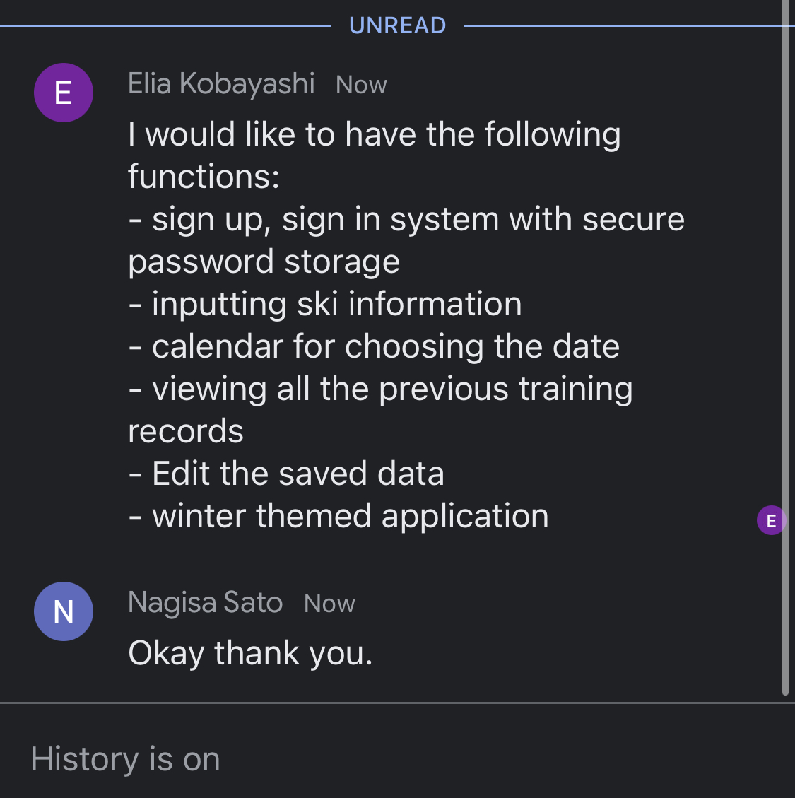
# Criteria B: Design

## Sketch of app
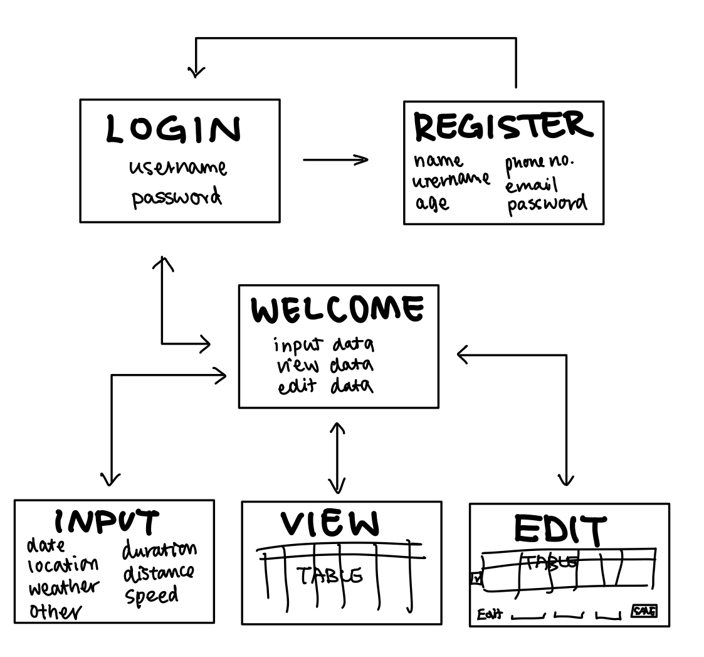 
Figure 1: Sketch of the relationship between the screens and their functions. This sketch roughly identifies the main screens and components neccesary in this application. 

## Wireframe
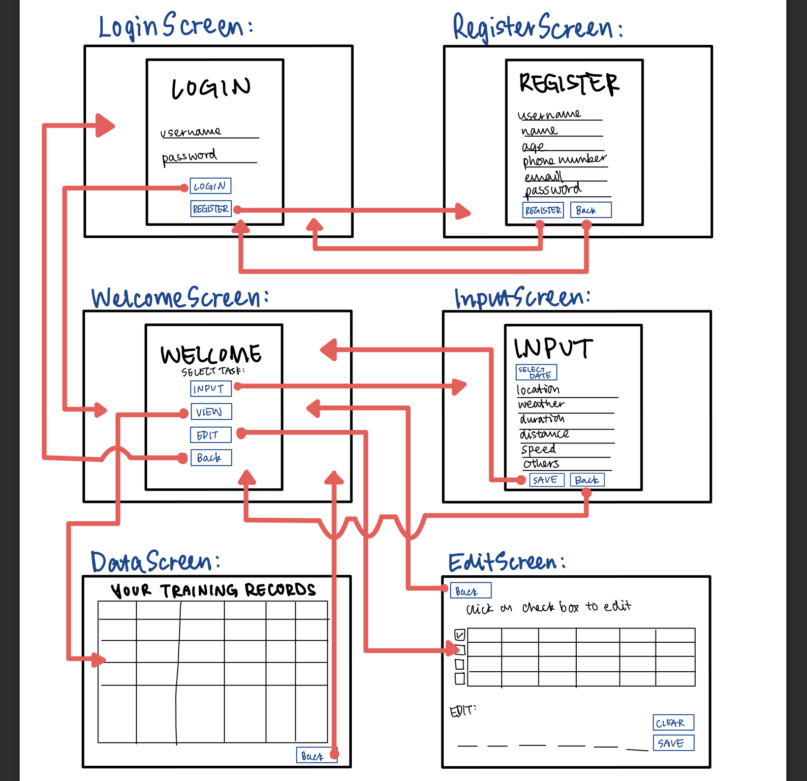
Figure 2: Wire frame diagram
The diagram above shows the correlations between the screens and the buttons. When each button is pressed, the screens transition as shown with the arrows on the diagram. All the screens offered in the Welcome Screen have buttons that return to the Welcome Screen, where the users can move on to working on their next task quickly.

## System Diagram
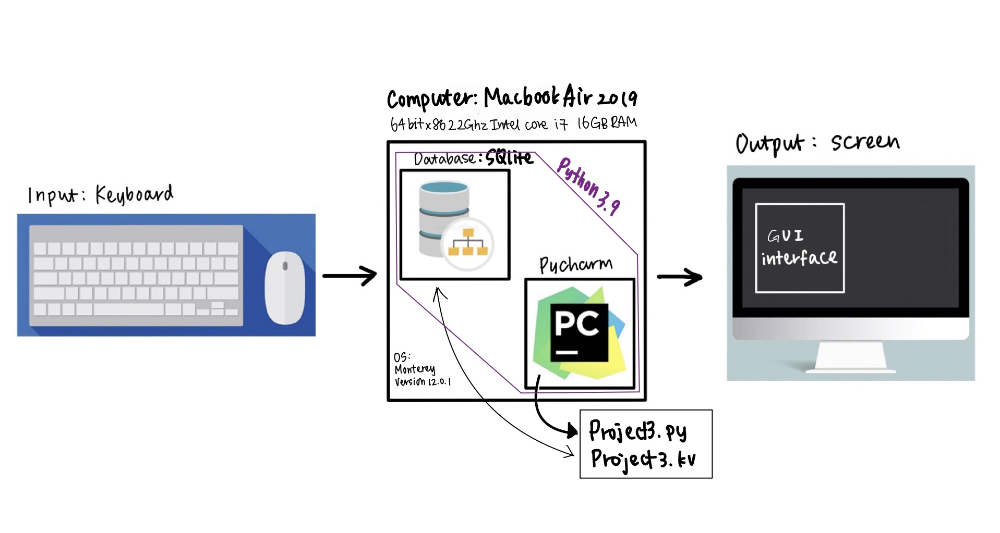 
Figure 3: Above is a system diagram for this project. The user inputs the information neccessary from the keyboard and cursor. The entered infromation in transferred into the computer, where there is a functioning application, Pycharm, which is connected to the data base called SQlite. When the application is ran by Pycharm, the application is displayed on an interface on the computer screen. Users can navigate the application from their keyboards and curcors. The system will be based on Mac OS 10.15.6 with Dual-Core Intel Core i3. This game will be created on python 3.9, where input will be from keyboard and output generated as text and visuals on screen monitor. 

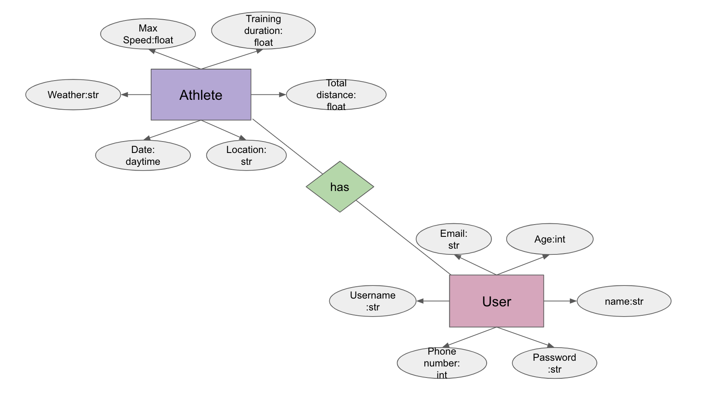 
Figure 4: ER diagram of user and ski athlete. The ER diagram shows the attributes of the classes; users, and athletes. These will be two data tables, however with relation to each other to work together in the application.

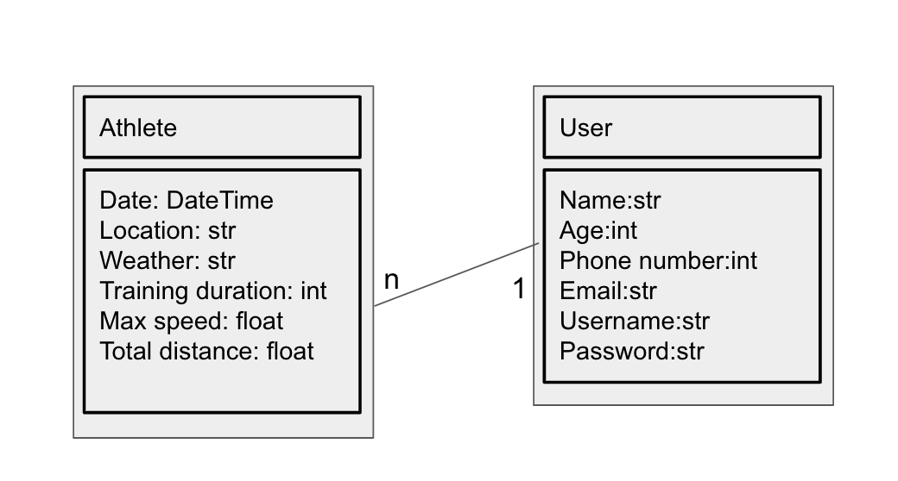 
Figure 5: UML diagram: this shows that there will be two datatables; user and athlete. 
For one user, there could be n number of athlete information inputs. This means that every user will own an Athlete table, where all their training records are saved and stored. 

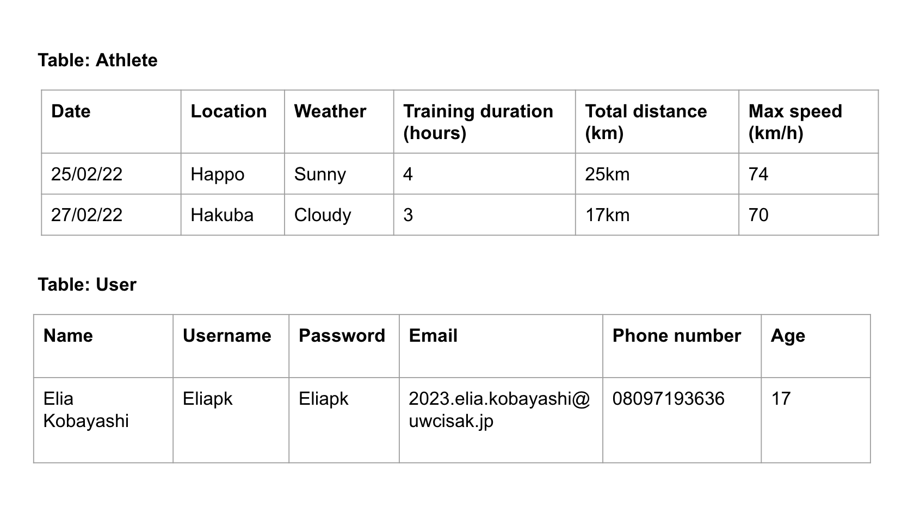 
Figure 6: sample table for both 'athlete' and 'athlete'. This is what the tables look in the databases. When more 'users', or 'athlete' information are saved into the database, ther will be additional rows created for the data to be saved into.

## Flow Diagrams
# Login Screen
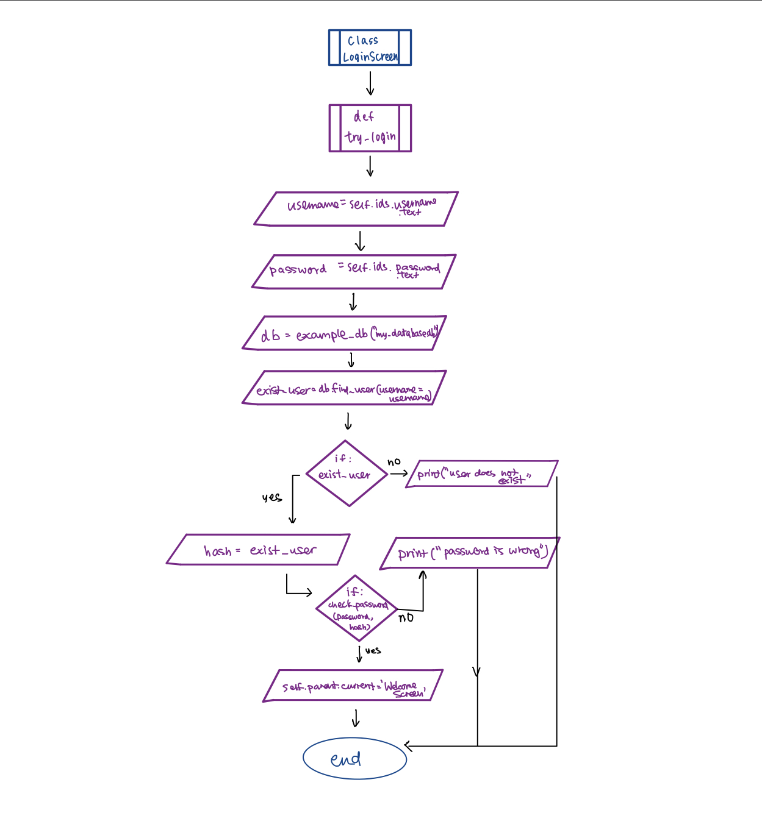 
Figure 7: Above is the flow diagram for the login screen. First we check the correspondance of information to their input fields. After, the system checks whether the user already exists in the database. If the user exists, they check for the password, there will be an arror if the user is not an existing user. If the password is correct, the user is able to transfer into the Welcome Screen. 

# Register Screen
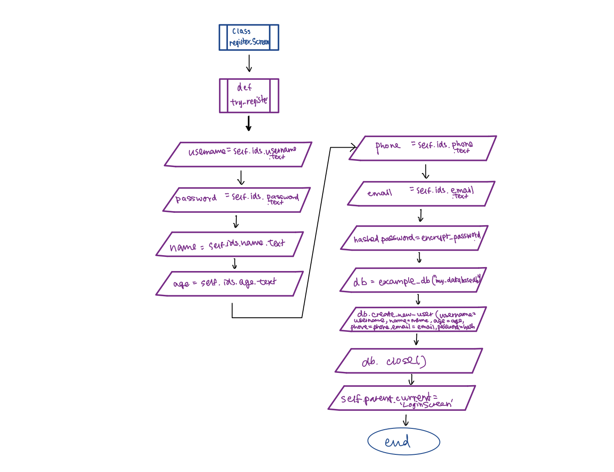 
Figure 8: Above is the flow diagram for the register screen. Similar to the login screen, it first check for correspondace of information to the text fields. The inputted information is then stored into the database, ready to be used in the login screen. The important part here is to make sure the password is stored encrypted for security and privacy. 

# Input Screen
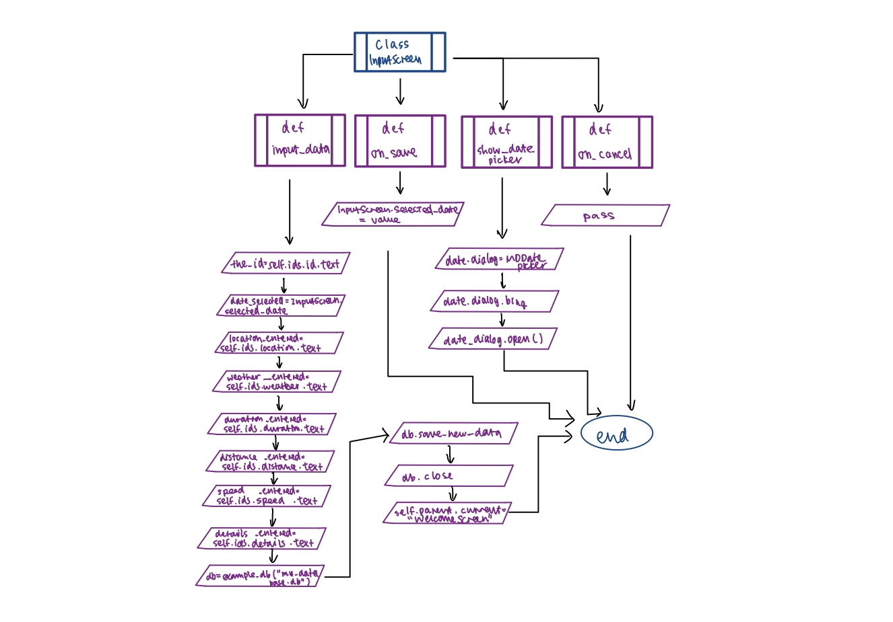 
Figure 9: This is the flow diagram for the input screen. The two parts in this screen are the data-selecting functions, and the other inofrmation input organizers. The date-pick makes sure to display the calendar, where users select the dates, where they can either save, or cancel. All data are then saved and stored into the database, table Athlete. 

# Data Screen
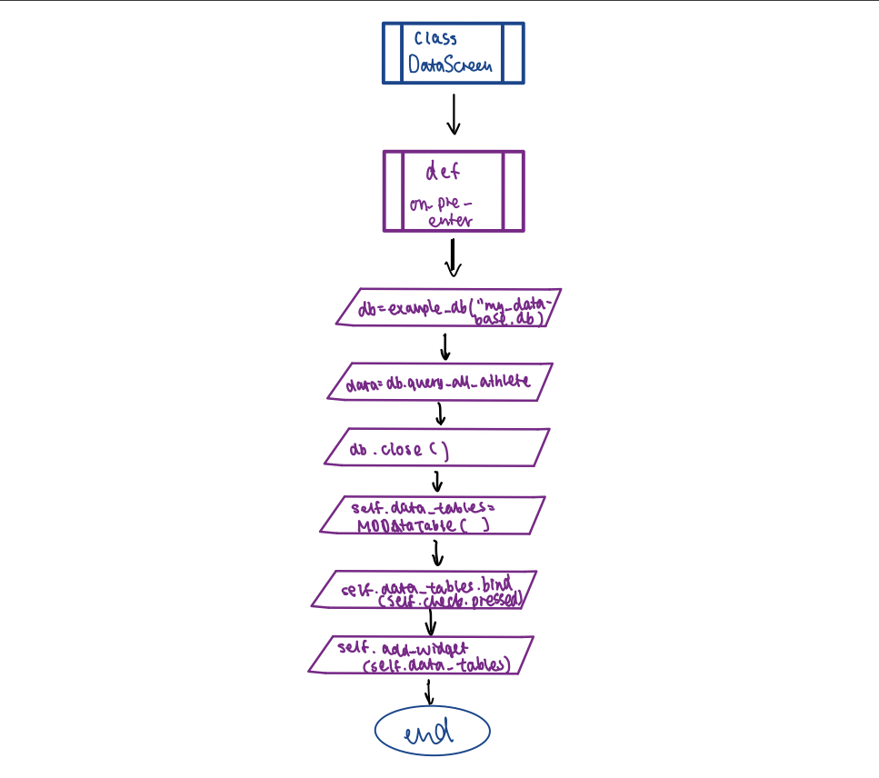 
Figure 10: This is the flow diagram for the data viewing screen. There is only one function being used here, of which the function fetches all the data from the table Atheltes. Then, an MDDataTable is used to create the table structure in the screen. 

# Edit Screen
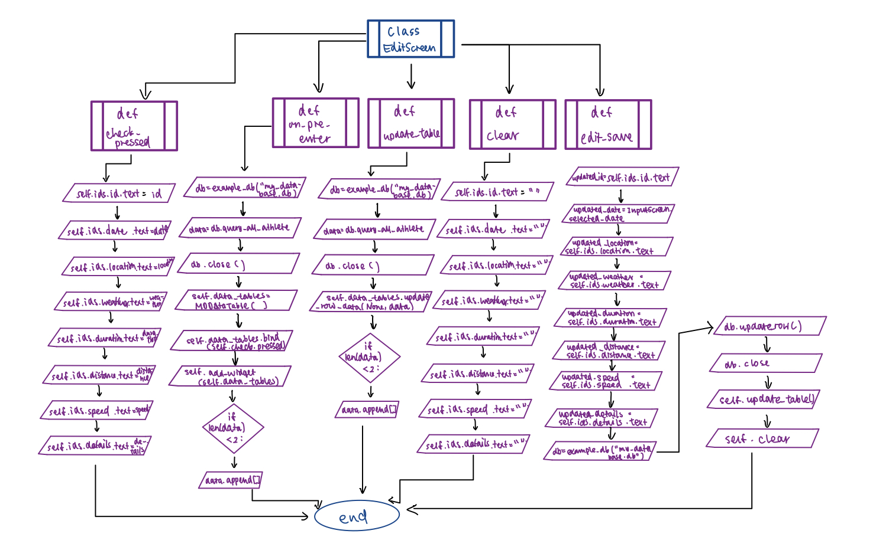 
Figure 11: This is the flow chart for the data editing screen. This is the screen where users can edit and make changes in their previously inputted data.The top side of the screen is meant to display the table, and the bottom of the screen to input the new editted data, where the new data could be saved, or cleared. 

## Test plan
| Description                          | Test type           | Input                                                                                                                  | Expectation                                                                                                                                                                   | Purpose                                                                      | Succes criteria |
|--------------------------------------|---------------------|------------------------------------------------------------------------------------------------------------------------|-------------------------------------------------------------------------------------------------------------------------------------------------------------------------------|------------------------------------------------------------------------------|-----------------|
| Functionality of the login screen    | unit testing        | 1. Input correct username and password 2. Input incorrect username or password                                         | 1. The screen transitions into Welcome Screen 2. error text is displayed, and the user re-enters the information                                                              | Testing if the login screen appropriately operates                           | 1               |
| Functionality of the register screen | unit testing        | 1. Input all fields and press 'register' 2. Miss out some fields and press 'register'                                  | 1. All data are saved into the Users table in the database 2. error text shows and tells the user that all fields must be filled                                              | Testing if the register screen appropriately operates                        | 1               |
| Functionality of the welcome screen  | unit testing        | Click all the screen transitions one by one                                                                            | Every button takes the users to the correct screens                                                                                                                           | Testing if the welcome screen appropriately operates                         | -               |
| Functionality of the input screen    | unit testing        | 1. Input all the text fields and press 'save' 2. Leave out some fields and hit 'save'                                  | The date is saved, using the calendar widget 1. All data are saved into the users table in the database 2. error text tells users that all neccesary fields must be filled in | Testing if the input screen appropriately operates                           | 4,3             |
| Functionality of the data screen     | unit testing        | none                                                                                                                   | The previous data are displayed on the screen                                                                                                                                 | Testing if the data screen appropriately operates                            | 5               |
| Functionality of the edit screen     | unit testing        | 1. Input the new data information into the text fields and 'save' 2. Leave some blanks in the text fields then, 'save' | 1. The data is renewed in the database and stored 2. error message tells user that input is incomplete or insufficient                                                        | Testing if the edit screen appropriately operates                            | 6               |
| Screen transitions and buttons       | Integration testing | none                                                                                                                   | All buttons the enter new screens, or returning to previous screens are functioning                                                                                           | Testing if the application is continuous and usable for the ultimate purpose | -               |
| Whole application run                | system testing      | Carry out test plan 1-5 consecutively  

## Record of Tasks
| Number of total minutes | Minutes to hours   |
|-------------------------|--------------------|
| 680 minutes             | 11hours 20 minutes |


| Task number | Planned action                                        | Planned outcome                                                         | Time estimate | Target completion date | Criteria |
|-------------|-------------------------------------------------------|-------------------------------------------------------------------------|---------------|------------------------|----------|
| 1           | Inquire the clients needs                             | rough plan of what the app would be                                     | 20            | March 2                | A        |
| 2           | Confirm proposed solution                             | there is a solid proposed solution for further process                  | 20            | March 4                | A        |
| 3           | Document; design statement, justification, details    | have all the three sections on github                                   | 30            | March 4                | A        |
| 4           | List and create success criteria, confirm with client | have confirmed criteria listed on github, after being checked by client | 20            | March 6                | A        |
| 5           | sketch the design solution                            | upload sketch of the application                                        | 20            | March 11               | B        |
| 6           | create system diagram                                 | create and upload the system diagram                                    | 20            | March 13               | B        |
| 7           | create ER diagram                                     | create and upload the ER diagram                                        | 20            | March 14               | B        |
| 8           | create UML diagram                                    | create and upload the UML diagram                                       | 20            | March 14               | B        |
| 9           | create sample table                                   | create and upload the sample tables                                     | 15            | March 18               | B        |
| 10          | create the kivy file with screens and details         | create the kivy file and screens within                                 | 60            | March 20 - April 14    | C        |
| 11          | prepare base of app                                   | create screen manager, basic settings of the app                        | 30            | March 21               | C        |
| 12          | code login screen                                     | code the login screen and all the functions inside                      | 40            | March 22-26            | C        |
| 13          | code welcome screen                                   | code the login screen and all the functions inside                      | 40            | March 26-28            | C        |
| 14          | code register screen                                  | code the register screen and all the functions inside                   | 40            | March 24-April 14      | C        |
| 15          | code data input screen                                | code the input screen and all the functions inside                      | 30            | March 28 - April 16    | C        |
| 16          | code data viewing screen                              | code the viewing screen and all the functions inside                    | 30            | April 17               | C        |
| 17          | code edit data screen                                 | code the editing screen and all the functions inside                    | 60            | April 17- 21           | C        |
| 18          | check the program                                     | confirm there are no error, check for good coding practices             | 30            | April 21               | C        |
| 19          | create flow diagrams                                  | create and upload flowcharts                                            | 30            | April 21               | B        |
| 20          | functionality testing                                 | follow test plan and carry out the tests                                | 60            | April 22               | D        |
| 21          | video demonstration                                   | create a video demonstration and upload                                 | 30            | April 22               | D        |
| 22          | upload all neccessary information on github           | have all sections ready for submission                                  | 15            | April 23               | -        |

# Criteria C: Development

## Existing tools
- KivyMD Library
- SQLite
- Relational databases
- Python OOP

## Techniques used
- if statements
- constructing a GUI with Kivy

Below is the code for the neccesary screens to operate the app:
```py
ScreenManager:
    id: scr_manager

    LoginScreen:
        name: "LoginScreen"
        id: "LoginScreen"

    RegistrationScreen:
        name: "RegisterScreen"
        id: "RegisterScreen"

    WelcomeScreen:
        name: "WelcomeScreen"
        id: "WelcomeScreen"

    InputScreen:
        name: "InputScreen"
        id: "InputScreen"

    DataScreen:
        name: "DataScreen"
        id: "DataScreen"

    EditScreen:
        name: "EditScreen"
        id: "EditScreen"
```
The ScreenManager stores and manages the screens inside, in there are the six screens. This is an essential initial part of the Kivy file to create a front end of the application. Appropriate names are given, as well as ids for easy use and understanding. 

## creating the databases 
```py
    def create(self):
        self.cursor.execute("""CREATE TABLE Users if not exists (
            name VARCHAR(200) not null,
            username VARCHAR(200) not null unique,
            age INTEGER not null,
            phone_number INTEGER unique, 
            email VARCHAR(255) not null unique,
            password VARCHAR (256) not null
        );
        """)

        self.cursor.execute("""CREATE TABLE Athlete if not exists(
                     id INTEGER primary key,
                     date VARCHAR(200) not null,
                     location VARCHAR(200) not null,
                     weather VARCHAR(255) not null,
                     duration FLOAT not null, 
                     speed FLOAT not null,
                     details VARCHAR (256) not null
                 );
                 """)
```
We will need to create a database to store the input data. In this app, we need to data sets: one for storing the user data (the first table on code), and the second one for storing the data that the user inputs about skiing. All the information inputted will be stored in the tables, accordingly. We are able to specify the input type as well as whether the input can/cannot be overlapping with other users'. We can also specify that the fields cannot be left blank by the users. 
           
## Login Screen
```py
class LoginScreen(MDScreen):
    def try_login(self):
        username = self.ids.username.text
        password = self.ids.password.text
        db = example_db("my_database.db")
        exist_user = db.find_user(username=username)
        db.close()

        if exist_user:
            hash = exist_user[5]

            if check_password(password, hash):
                #login successful
                self.parent.current = 'WelcomeScreen'

            else:
                print("Password is wrong")
```
This is an example of a screen python code. This is the code for the login screen. In the login screen, the user has to input their username and password. Then, the code checks whether the user exists already on the database on table "users". Using the 'if' statement, if the user exists, it checks for the password, then the user can proceed to enter the welcome screen. If the password do not match, the user needs to reenter their information. As shown on code, the session is connected to the database, where it referenced the input to the stored data. 

## Welcome Screen
```py
class WelcomeScreen(MDScreen):
    pass
```
```py
<WelcomeScreen>:
    BoxLayout:
        size: root.height, root.width
        orientation:"vertical"
        FitImage:
            source: "snowbackground.jpeg"

    MDCard:
        size_hint: 0.8, 0.8
        elevation: 10
        pos_hint: {"center_x": .5, "center_y": .5}
        orientation: "vertical"

        MDBoxLayout:
            id: content
            adaptive_height: True
            orientation: "vertical"
            padding: dp(30)
            spcing: dp(40)

            MDLabel:
                text: "Welcome"
                pos_hint: {'center_x': 0.5, 'center_y': 0.4}
                halign: "center"

            MDLabel:
                text: "Select your task"
                pos_hint: {'center_x': 0.5, 'center_y': 0.5}
                halign: "left"

            MdRaisedButton:
                text: "Input new data"
                halign: "center"
                on_release:
                    root.parent.current = "InputScreen"

            MDRaisedButton:
                text: "View data"
                halign: "center"
                on_release:
                    root.parent.current = "DataScreen"

            MDRaisedButton:
                text: "Edit data"
                halign: "center"
                on_release:
                    root.parent.current = "EditScreen"

            MDRaisedButton:
                text:"Back"
                halign: "left"
                on_release:
                    root.parent.current = "LoginScreen"
```
This is an example of a format of the front end-side of the screen. The welcome screen is operated by the front-end of the prodedure. There are no inputs and it is a screen where the users are guided to other screens to; input data, view data, or edit data. When the buttons are pressed, the user can move accordingly, and return to this screen by clicking 'back' in each of the screens. The BoxLayout creates an environemnt for the other elements such as label and buttons to be organized. I personally decided to put all labels and buttons on the MDCard for cleaner and tidier looks of the screen to enhance user experience. The BoxLayout is used again to organize the elements in the MDCard. 

## Hash Password
```py
def encrypt_password(password):
    return pwd_context.encrypt(password)
```
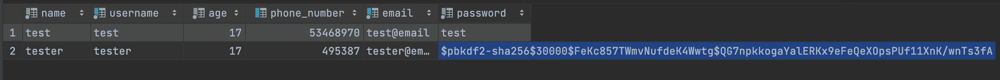
This function is used in 'class register', where the user inputs their newly-created passwords. Their passwords could be stored as it is, but in considereation of security and privacy, this application encrypts the password. The image below the code shows the password storage difference between the hashed, and non-hashed storages. Row 1, last column is the password as it is. Row 2, last column's actual password is 'tester', however with the encrypt function, we are not able to find out the password. This makes the accounts secure. 

## updating the table
```py
    def update_table(self):
        db = example_db("example.db")
        data = db.query_all_athlete()
        db.close()

        # The MDtable needs at least two values as input
        if len(data) < 2:
            data.append(["", "", "", "", "", "", ""])

        self.data_tables.update_row_data(
            None, data
        )
 ```
 ```py
     def query_all_athlete(self):
        # fetch all creates a list with all the results
        result = self.cursor.execute("SELECT * from Athlete;").fetchall()
        return result
```
This is an example of a function where the data from the database are pulled onto the interface, where it is physically displayed.  Within the function (one on the top), it uses another function called query_all_athlete, which is defined at the beginning of the code in the actualy python file. (code display under def update_table). This functions collects all the data from the database and creates a list with the results. This way, the accurate data are directly sent onto the interface and displayed into the same format of, a table. 

## Operating the calendar
Below is the essential calendar operation for the Input Screen.
```py
##operating the calendar
    def on_save(self, instance, value, date_range):
        label = "Date selected: "
        date_output = label + str(value)
        self.ids.date_picker_label.text = date_output
        InputScreen.selected_date = value

    def on_cancel(self, instance, value):
        self.root.ids.date_label.text= 'Cancelled'

    def show_date_picker(self):
        self.theme_cls.theme_style = "Light"
        self.theme_cls.primary_palette = "BlueGray"
        #defaults a certain date
        date_dialog = MDDatePicker(year=2022, month=4, day=28 )
        date_dialog.bind(on_save=self.on_save, on_cancel=self.on_cancel)
        date_dialog.open()
```
The calendar pops up in the input screen, where users need to select a certain date for their data. To make this user-freindly, I added a feature where the default date is near the current date, so that users do not have to move through calendars much. The entire operation consists of three sections; function that saves the selected date, function that cancels the selected date thus exits table, and function that displays the calendar. There is a special command for the calendar named MDDatePicker, which can be imported via terminal and can be utilized.

### Example screens of the application 
## Login screen
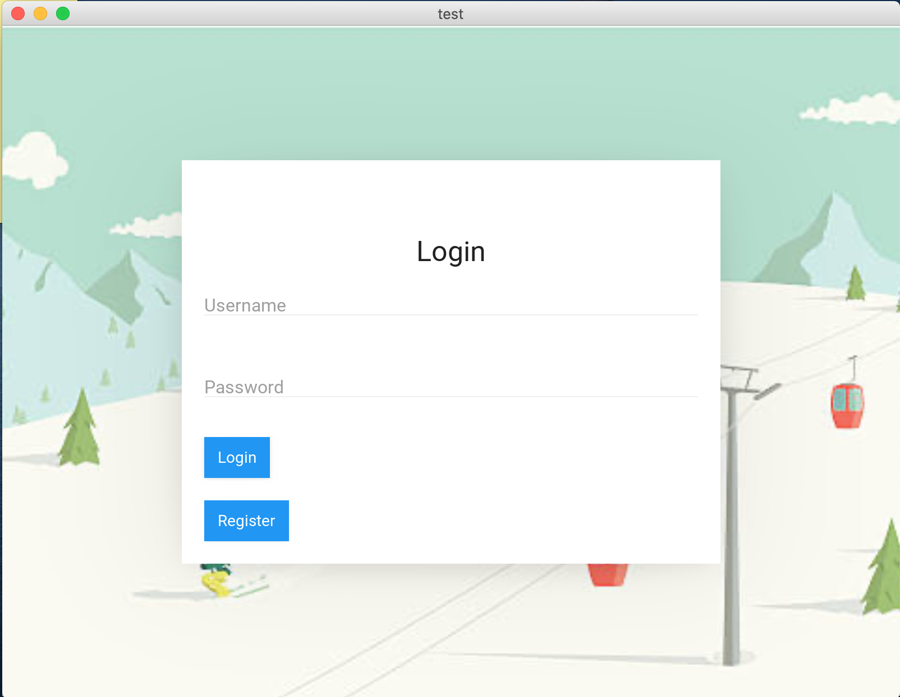
## Welcome screen
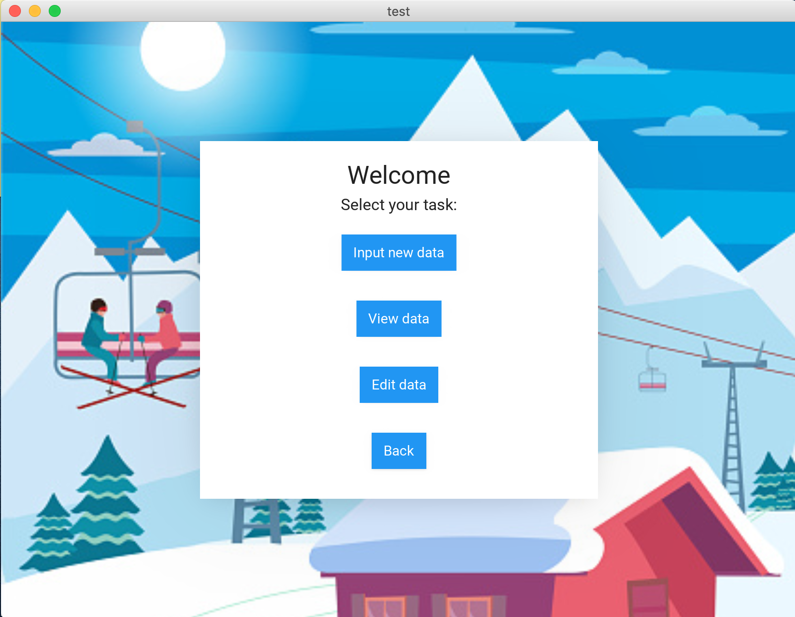
## register screen
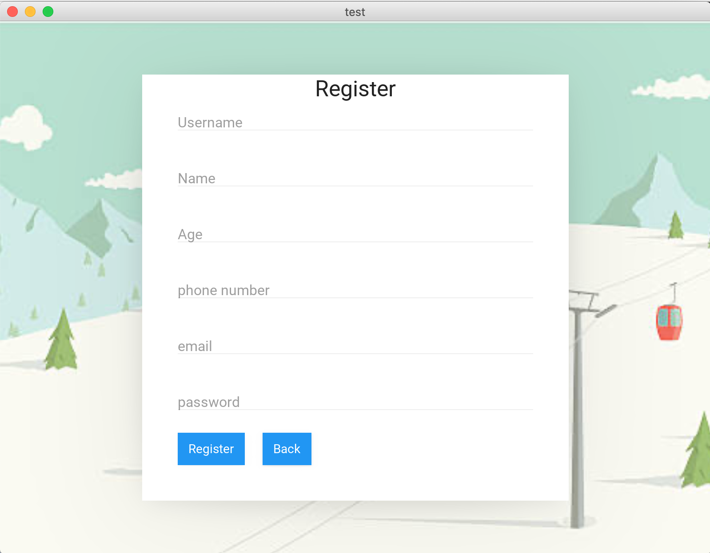
## Input screen
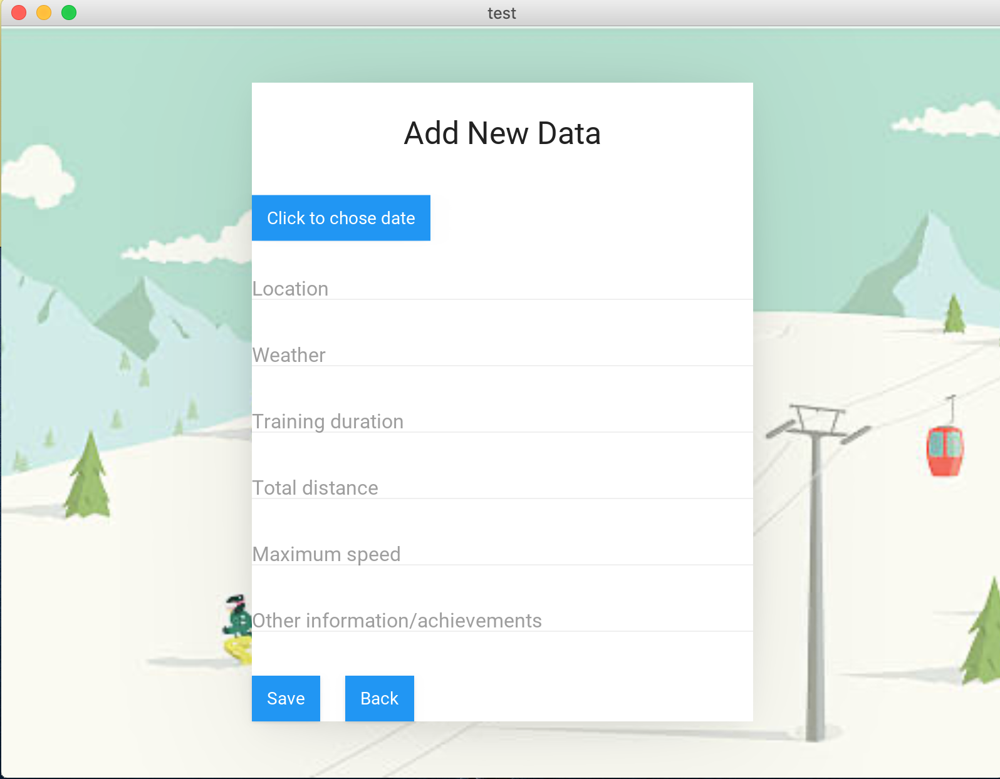
## Edit screen
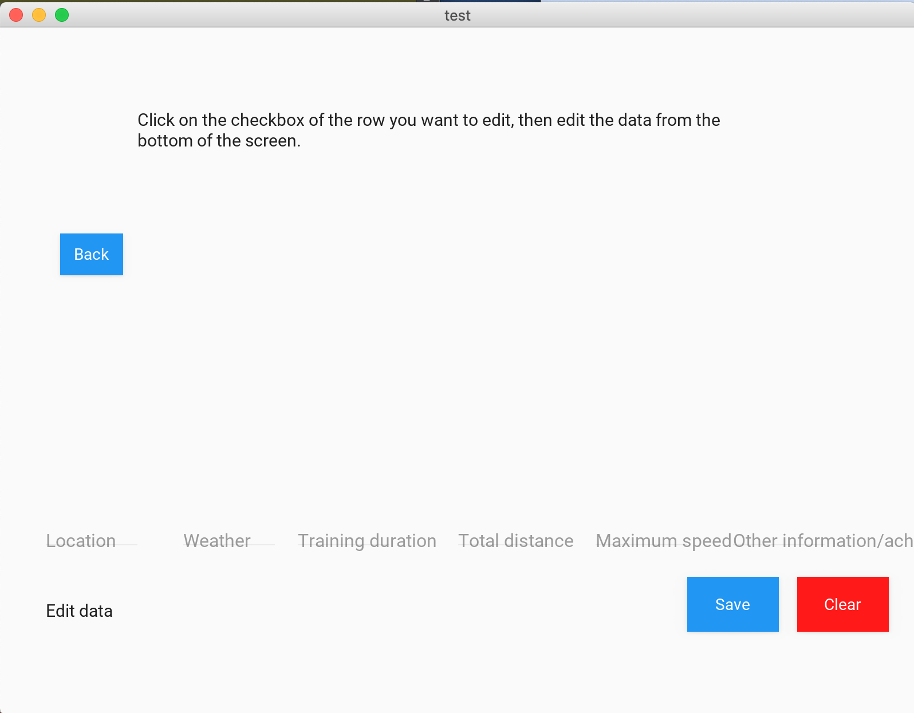
## Calendar 
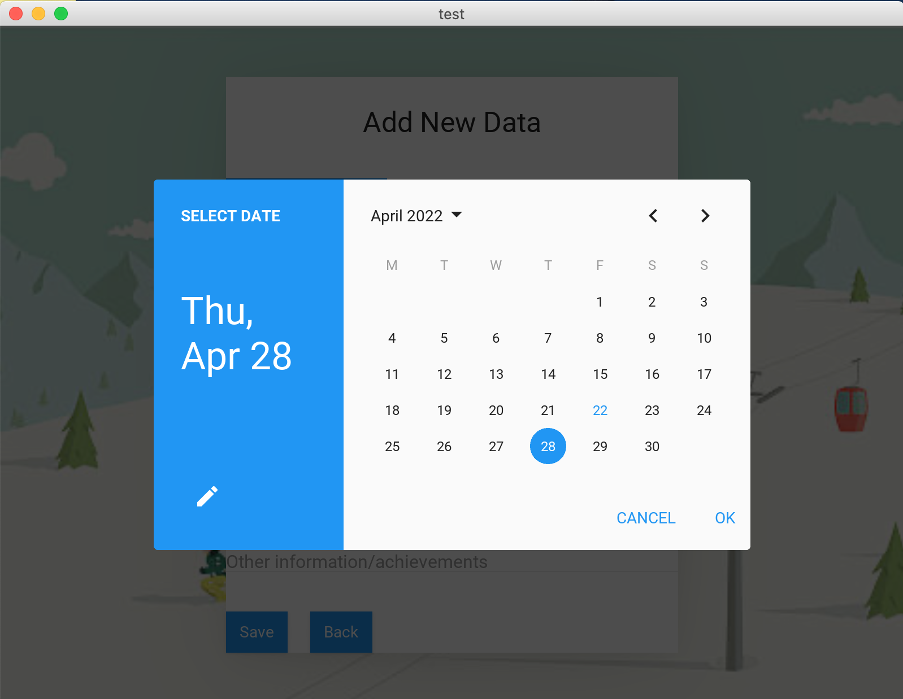

# Criteria D 
https://drive.google.com/file/d/1WYsDit08M4OBJ0K6KMS7iItz_DuYEP7I/view?usp=sharing 

### Software updates
To continue innovating and updating the application, we must provide occasional updates. The update system that I would like to use for this application is phased update. Phased update refers to the type of update in which the update occurs for a long period of time, as only once section of the program is changed at a time. I chose this type of update becuase, I am not a very proficient coder, therefore, it could be a risk if I update the entire system at once because there is a large possibility for errors in the system. In addition, updates should occur at least once a month, from beta testing and other forms of user feedbacks. 

### Citations
“What Is Kivy?” GeeksforGeeks, 30 Jan. 2020, www.geeksforgeeks.org/what-is-kivy/. 

Appropriate Uses for SQLite, www.sqlite.org/whentouse.html#:~:text=They%20emphasize%20scalability%2C%20concurrency%2C%20centralization,compete%20with%20client%2Fserver%20databases. 

“Theming.” Theming - KivyMD 1.0.0.dev0 Documentation, kivymd.readthedocs.io/en/latest/themes/theming/index.html. 

“SQLAlchemy 1.3 Documentation.” Basic Use - SQLAlchemy 1.3 Documentation, docs.sqlalchemy.org/en/13/orm/extensions/declarative/basic_use.html. 

“SQLALCHEMY 1.1 Documentation.” Engine Configuration - SQLAlchemy 1.1 Documentation, docs-sqlalchemy.readthedocs.io/ko/latest/core/engines.html. 

SQL Create Table and Insert Data - Youtube. www.youtube.com/watch?v=LAP9-vu-KgU. 

Google Search, Google, www.google.com/search?q=cute%2Bski%2Bfield%2Billustration&amp;tbm=isch&amp;ved=2ahUKEwjItP-K8aT3AhVHy4sBHTmsDWIQ2-cCegQIABAA&amp;oq=cute%2Bski%2Bfield%2Billustration&amp;gs_lcp=CgNpbWcQAzoHCCMQ7wMQJ1DXCljKD2DqEGgAcAB4AIABXIgB3gSSAQE3mAEAoAEBqgELZ3dzLXdpei1pbWfAAQE&amp;sclient=img&amp;ei=XClhYsiWH8eWr7wPudi2kAY&amp;bih=789&amp;biw=1440&amp;rlz=1C5CHFA_enJP910JP911#imgrc=fJIdibKTkeRDbM&amp;imgdii=oUM14q7S6vTRhM. 
